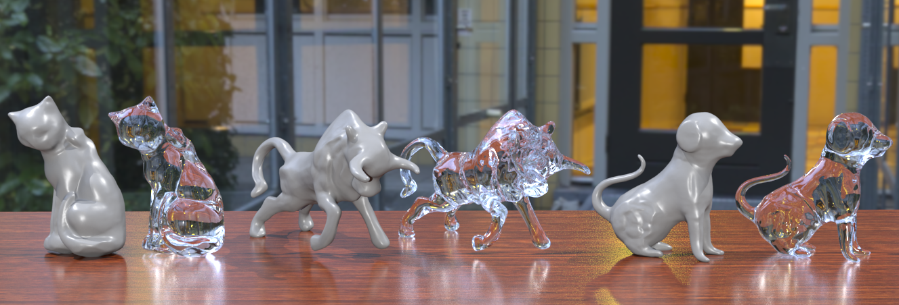

<!-- PROJECT LOGO -->

  <h1 align="center">Hybrid Mesh-neural Representation for 3D Transparent Object Reconstruction
</h1>
  

    <a href=""><strong>Jiamin Xu</strong></a>
    ·
    <a href=""><strong>Zihan Zhu</strong></a>
    ·
    <a href=""><strong>Hujun Bao</strong></a>
    ·
    <a href=""><strong>Weiwei Xu</strong></a>
    ·
  

  <h3 align="center">Computational Visual Media Journal (CVMJ)</h2>
  <h3 align="center"><a href="https://arxiv.org/pdf/2203.12613v3.pdf">Paper</a> | <a href="">Video</a> | <a href="">Project Page</a></h3></h3>
  

  
  

 

